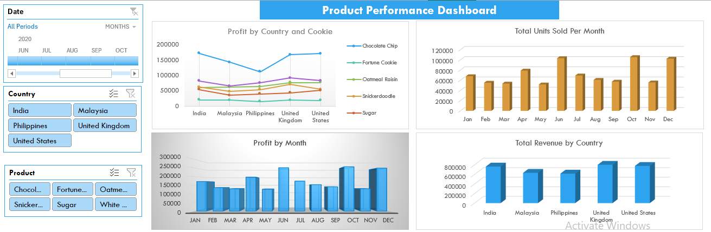
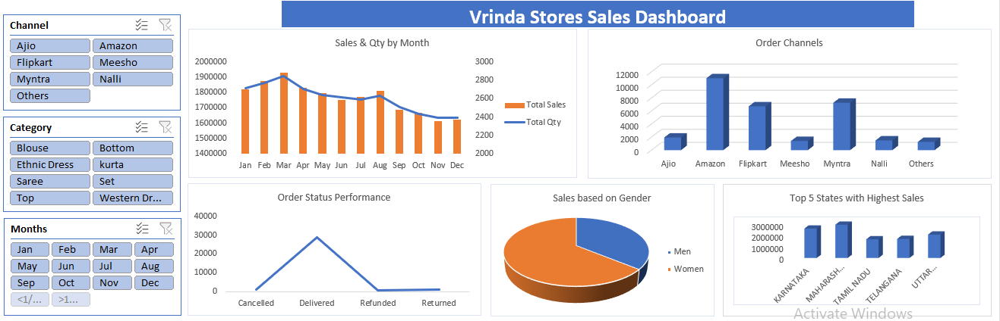

# Data Analytics Portfolio
# Project 1
**Title:** [Product Performance Dashboard](https://github.com/rasidatyekeen/rasidatyekeen.github.io/blob/main/Product%20Performance%20Dashboard.xlsx)

**Tools Used:** Microsoft Excel (Pivot Chat, Pivot tables, Conditional formating, filters, slicers, timelines)

**Project Description:** This project involved analysing product data of cookies company to identify trends and patterns in sales performance for 2020.

**Key findings:**

**Dashboard Overview:** 

# Project 2
**Title:** [Vrinda Stores Sales Dashboard]()

**Tools Used:** Microsoft Excel (Pivot Chat, Pivot tables, Conditional formating, filters, slicers, timelines)

**Project Description:** This project involved analysing product data of Vrinda Stores to identify trends and patterns in sales performance.

**Key findings:**

**Dashboard Overview:** 

# Project 3
**Title:** Employee Records Cleansing

**SQL CODE:** [Employee Records queries](https://github.com/rasidatyekeen/rasidatyekeen.github.io/blob/main/Employee%20Records)

**SQL SKILLS:** 

**Project Description:** 

**Technology used:** SQL server

# Project 4
**Title:** Car Sales Data Cleansing

**SQL CODE:** [Car Sales Data queries](https://github.com/rasidatyekeen/rasidatyekeen.github.io/blob/main/Car%20Sales%20Data)

**SQL SKILLS:** 

**Project Description:** 

**Technology used:** SQL server
