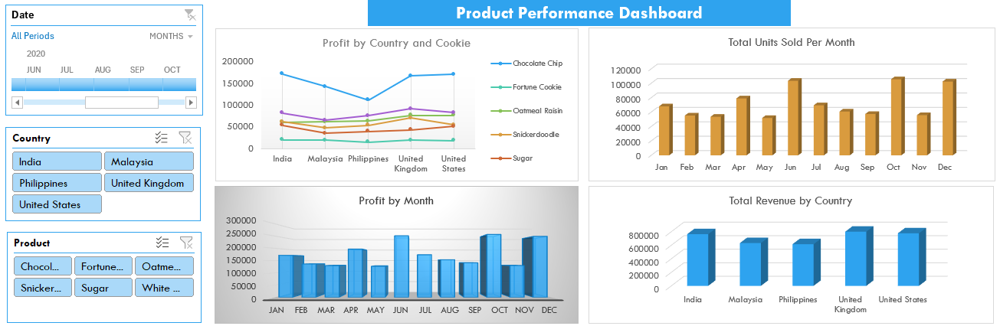
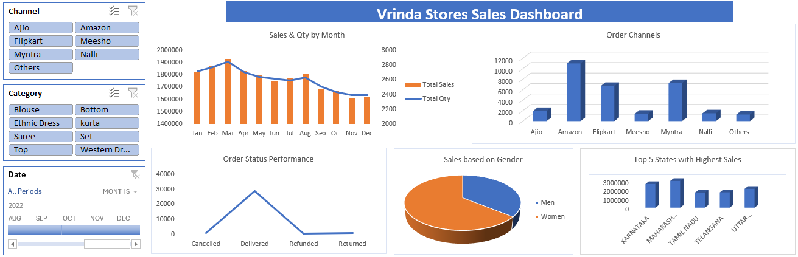
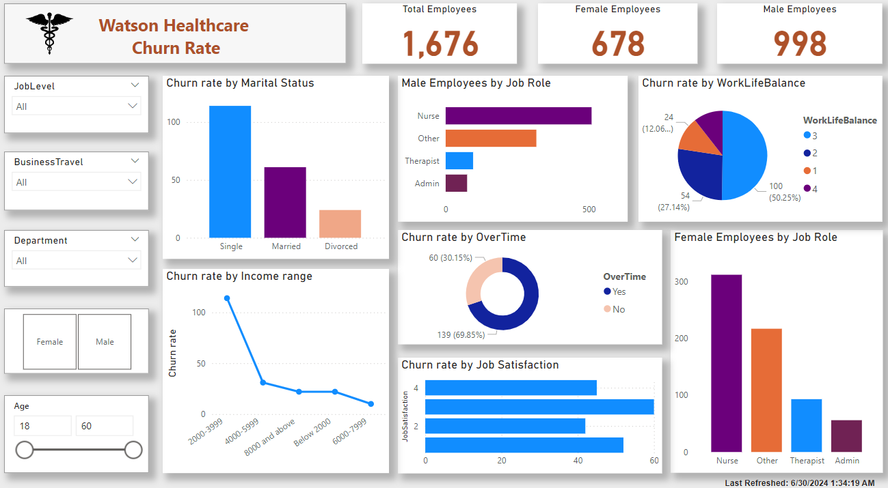
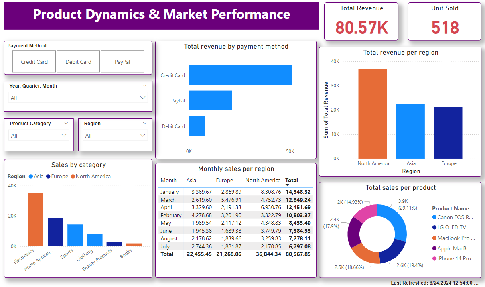

# Data Analytics Portfolio
# Project 1
**Title:** [Product Performance Dashboard](https://github.com/rasidatyekeen/rasidatyekeen.github.io/blob/main/Product%20Performance%20Dashboard.xlsx)

**Tools Used:** Microsoft Excel (Pivot Chart, Pivot tables, Power Query, Conditional formating, filters, slicers, timelines)

**Project Description:** This project involved analysing product data of cookies company to identify trends and patterns in sales performance for 2020. It is designed to provide a comprehensive overview of key performance metrics. This dashboard allows stakeholders to easily monitor and analyze the company's performance across different regions, products, and time periods. The dashboard includes the following features:

*Profit by Country and Cookies:* Visual representation of profits broken down by each country and type of cookie.

*Total Units Sold per Month:* A monthly breakdown of the total units sold, providing insights into sales trends over time.

*Profit by Month:* Displays the monthly profit, allowing for easy comparison of profitability throughout the year.

*Total Revenue by Country:* Highlights the total revenue generated in each country, showcasing the performance in different markets.

Additionally, the dashboard includes interactive slicers and timeline for:

*Month:* Filter the data to view performance for a specific month or range of months.

*Country:* Focus on specific countries to analyze regional performance.

*Product:* Drill down into the performance of individual cookie products.

**Key findings:**

*Regional Profitability:* Identified the most profitable countries and highlighted regions where performance could be improved.

*Seasonal Trends:* Revealed patterns in sales and profit that correspond with seasonal events, allowing for more strategic planning.

*Top-Performing Products:* Highlighted which cookie products are driving the most revenue and profit, aiding in inventory and marketing decisions.

*Sales Volatility:* Analyzed monthly sales fluctuations to understand market dynamics and adjust business strategies accordingly.

This dashboard serves as a crucial tool for the cookies company's management team, providing clear, actionable insights that drive informed decision-making and strategic planning.

**Dashboard Overview:** 

# Project 2
**Title:** [Vrinda Stores Sales Dashboard](https://github.com/rasidatyekeen/rasidatyekeen.github.io/blob/main/Vrinda%20Stores%20Sales%20Dashboard.xlsx)

**Tools Used:** Microsoft Excel (Pivot Chat, Pivot tables, Conditional formating, filters, slicers, timelines)

**Project Description:** The Sales Dashboard for Vrinda Stores is designed to provide a detailed analysis of sales performance across different dimensions. This dashboard offers a comprehensive view of the sales data, helping stakeholders to make informed decisions and optimize business strategies. The key features of the dashboard include:

*Sales and Quantity by Month:* Monthly breakdown of sales revenue and quantity sold, offering insights into seasonal trends and monthly performance.

*Order Channels:* Analysis of sales through different order channels, such as online, in-store, and third-party platforms, helping to identify the most effective sales channels.

*Order Status Performance:* Evaluation of orders based on their status (completed, pending, canceled), providing insights into operational efficiency and customer satisfaction.

*Sales Based on Gender:* Breakdown of sales by gender, allowing for targeted marketing and product development strategies.

*Top 5 States with Highest Sales:* Identification of the top-performing states in terms of sales, highlighting key markets and regions with growth potential.

The dashboard includes interactive slicers for:

*Channel:* Analyze sales performance across different sales channels.

*Category:* Group products into broader categories for a higher-level view.

*Date (Month):* Filter data to view performance for specific months or periods.

**Key findings:**

*Monthly Sales Trends:* Identified significant fluctuations in monthly sales, enabling better forecasting and inventory management.

*Effective Sales Channels:* Determined the most productive order channels, helping to allocate resources and marketing efforts more efficiently.

*Order Fulfillment Efficiency:* Highlighted areas for improvement in order processing and fulfillment to reduce cancellations and pending orders.

*Customer Demographics:* Provided insights into gender-based purchasing behavior, supporting targeted marketing campaigns and product offerings.

*Regional Sales Performance:* Pinpointed the top 5 states driving the highest sales, offering opportunities for focused business development and regional marketing initiatives.

This dashboard serves as a vital tool for Vrinda Stores' management, delivering clear, actionable insights to enhance decision-making, improve operational efficiency, and drive business growth.

**Dashboard Overview:** 

# Project 3
**Title:** Employee Records Cleansing

**SQL CODE:** [Employee Records queries](https://github.com/rasidatyekeen/rasidatyekeen.github.io/blob/main/Employee%20Records)

**SQL Skills Used:** 

*Data Retrieval (SELECT):* Used to query and retrieve specific data from the database.

*Data Filtering (WHERE, HAVING):* Applied filters to extract only relevant data.

*Data Aggregation (GROUP BY, COUNT):* Performed aggregations to analyze data patterns.

*Data Cleaning (UPDATE, DELETE):* Corrected and removed inaccurate or duplicate data.

*Data Validation (CASE, ISNULL):* Ensured data integrity by handling null values and applying conditional logic.

*Joins (INNER JOIN, LEFT JOIN, RIGHT JOIN):* Combined data from multiple tables for comprehensive analysis.

*Subqueries and CTEs:* Used for complex queries and to improve readability and maintainability of SQL code.

*String Manipulation and Pattern Matching (LIKE, WILDCARDS, CONCAT, SUBSTRING):* Performed operations to search for patterns within text fields and combined strings for data standardization and reporting purposes.

*Data Type Conversion (CAST):* Converted data types to ensure compatibility and accuracy in data processing.

*Date and Time Functions (GETDATE):* Managed and manipulated date and time data for time-based operations and reporting.

**Project Description:** 

Project Description:
The Employee Records Cleansing project was undertaken to ensure the accuracy, consistency, and completeness of the employee data stored in the SQL Server database. The primary goal was to identify and rectify any issues within the employee records, including duplicates, missing values, and incorrect data entries. This project involved several key steps:

*Data Profiling:*

- Conducted an initial assessment of the employee records to identify common data quality issues.
- Analyzed the distribution, range, and patterns within the data to understand the extent of the cleansing required.

*Data Standardization:*

- Standardized data formats for fields such as phone numbers, addresses, and names to maintain consistency.
- Converted data into appropriate formats where necessary (e.g., date formats, case sensitivity).

*Data Validation and Correction:*

- Implemented validation checks to identify and correct erroneous data entries.
- Used SQL functions and conditional logic to handle null values and incorrect data formats.

*String Manipulation and Functions:*

- Used wildcards and the *LIKE* operator to identify records matching specific patterns.
- Employed the *CONCAT* function to combine string fields for standardized reporting and data integration.
- Utilized *SUBSTRING* to extract specific parts of text fields for accurate data representation.

*Data Type Conversion:*

- Applied the *CAST* function to convert data types, ensuring consistency and accuracy in data processing.

*Date and Time Functions:*

- Utilized the *GETDATE* function to retrieve current date and time for time-based data operations and validation.

*Data Integrity:*

- Ensured referential integrity by verifying relationships between tables.
- Updated or deleted records that violated integrity constraints to maintain data consistency.

*Documentation and Reporting:*

- Documented the data cleansing process, including the steps taken and the SQL scripts used.
- Generated reports to summarize the improvements in data quality and the outcomes of the cleansing process.

This project significantly enhanced the quality of the employee data, ensuring that it is accurate, reliable, and ready for use in reporting and decision-making processes. The clean data now supports better HR management, payroll processing, and compliance reporting.

**Technology used:** SQL server

# Project 4
**Title:** Car Sales Data Cleansing

**SQL CODE:** [Car Sales Data queries](https://github.com/rasidatyekeen/rasidatyekeen.github.io/blob/main/Car%20Sales%20Data)

**SQL SKILLS:** 

**Project Description:** 

**Technology used:** SQL server

# Project 5
**Title:** Pizza Sales Data Cleansing

**SQL CODE:** [Stateside Foods Pizza Data queries](https://github.com/rasidatyekeen/rasidatyekeen.github.io/blob/main/Stateside%20Foods%20Pizza)

**SQL SKILLS:** 

**Project Description:** 

**Technology used:** SQL server

# Project 6
**Title:** [Watson Healthcare Employee Churn Rate](https://github.com/rasidatyekeen/rasidatyekeen.github.io/blob/main/Watson%20healthcare%20Employee%20data.pbix)

**Tools Used:** PowerBI (Power Query, DAX, Dashboard,ETL Processes, Data Cleaning, Data Transformation,Data Modelling)

**Project Description:** This project involved analysing product data of cookies company to identify trends and patterns in sales performance for 2020.

**Key findings:**

**Dashboard Overview:** 

# Project 7
**Title:** [Product Dynamics and Market Performance Dashboard](https://github.com/rasidatyekeen/rasidatyekeen.github.io/blob/main/Product%20Dynamics%20%26%20Market%20Performance%20Portfolio.pbix)

**Tools Used:** PowerBI (Power Query, DAX, Dashboard,ETL Processes, Data Cleaning, Data Transformation,Data Modelling)

**Project Description:** This project involved analysing product data of cookies company to identify trends and patterns in sales performance for 2020.

**Key findings:**

**Dashboard Overview:** 

